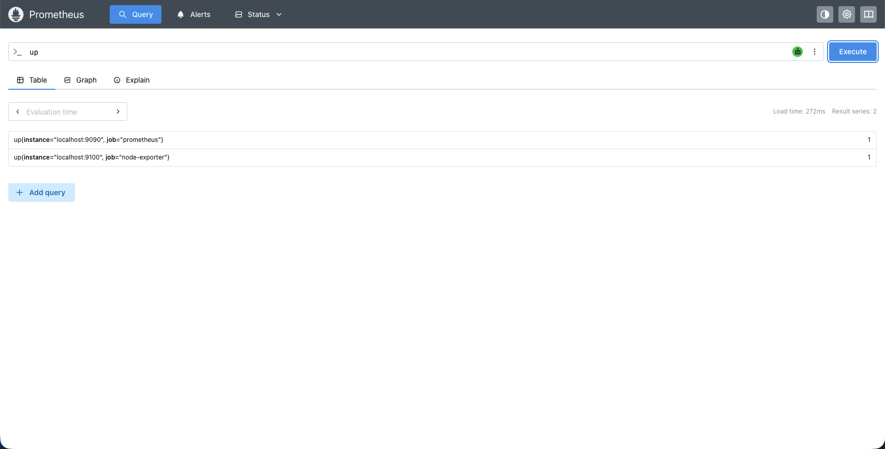
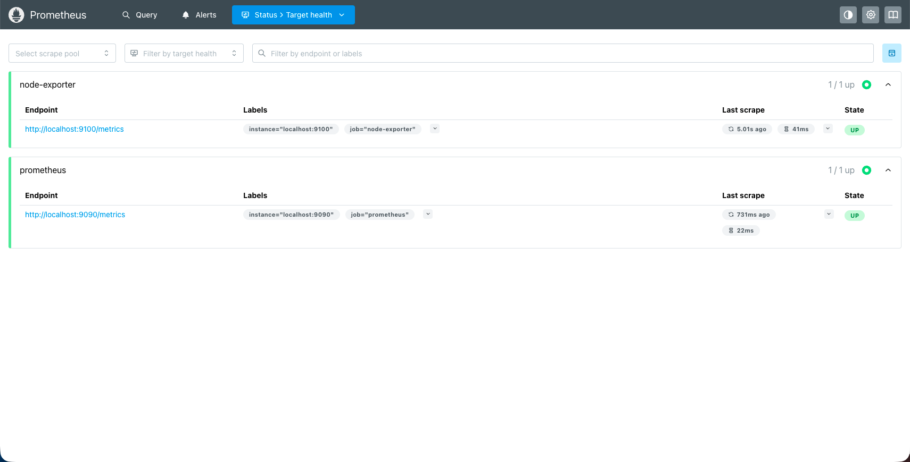

# 安裝並啟動 Prometheus

官方文件：[安裝說明](https://prometheus.io/docs/prometheus/latest/installation/)、[下載頁](https://prometheus.io/download/)

Prometheus 每 5 秒去抓一次 exporter 的 `/metrics`，把時間序列存起來給 Grafana 查詢。開始之前先完成 [01-setup-python-environment.md](01-setup-python-environment.md)。

## 1. 安裝

**macOS：**

```bash
brew install prometheus
```

**Linux：** 到[下載頁](https://prometheus.io/download/)確認最新版本再填入 `PROM_VERSION`。

```bash
PROM_VERSION="3.12.0"
curl -LO "https://github.com/prometheus/prometheus/releases/download/v${PROM_VERSION}/prometheus-${PROM_VERSION}.linux-amd64.tar.gz"
tar xvf "prometheus-${PROM_VERSION}.linux-amd64.tar.gz"
cd "prometheus-${PROM_VERSION}.linux-amd64"
```

**Windows：** 在[下載頁](https://prometheus.io/download/)下載 `prometheus-*windows-amd64.zip`，解壓縮到任意目錄，例如 `C:\prometheus`。

## 2. 啟動

在終端機執行，Windows 用 PowerShell。切換到教材根目錄再啟動，設定檔依據自己平台。

```bash
cd <你放教材的位置>/aiops-anomaly-zero-to-hero
prometheus --config.file=infra/prometheus/prometheus.<你的 OS {macos, linux, windows}>.yml --web.enable-lifecycle
```

這個視窗請保持開啟**維持執行，並開新的終端機執行之後的指令**。**不要用 `brew services start prometheus` 或 `systemctl start prometheus` 直接啟動**，那會載入套件自己的預設設定檔。

## 3. 驗收

在瀏覽器開啟 <http://localhost:9090>，在 Expression 欄位查詢 `up`。

`job="prometheus"` 應該是 `1`；`job="node-exporter"`（Windows 是 `windows-exporter`）在你完成 [04-install-node-exporter.md](04-install-node-exporter.md) 之前會是 `0`，那是正常的。

<http://localhost:9090/targets> 是對應的圖形介面。

確認完即完成本章節 Prometheus 安裝。

若查詢結果裡完全沒有 `node-exporter`，就是設定檔載錯了，請再次確認`aiops-anomaly-zero-to-hero/infra/prometheus` 中的 .yaml。

## 常見問題

**Grafana 上的流量 panel 一直是空的？**
查詢 `up`，看有沒有 `job="node-exporter"` 這一筆。找不到就是載入了套件預設設定檔，見〈用 service 啟動〉。有這一筆但值是 `0`，代表設定對了、exporter 還沒啟動，去做 [04-install-node-exporter.md](04-install-node-exporter.md)。

**偏離分數 panel 一直是空的？**
查詢 `up{job="aiops-detector"}`。那個 job 抓的是 Lab 00 才會啟動的 `detector.py`，setup 階段是 `0`，屬於正常。

**`curl -X POST http://localhost:9090/-/reload` 回 405？**
啟動時沒有帶 `--web.enable-lifecycle`。前景啟動就直接加這個參數，service 啟動就把它加進 `prometheus.args` 再重啟。

**瀏覽器無法開啟 `localhost:9090`？**
確認指令視窗仍在執行中。看到 `address already in use` 表示 9090 已被占用，先關閉舊的 Prometheus 程序。

**macOS 顯示 `brew: command not found`？**
先安裝 [Homebrew](https://brew.sh)，或改用官方下載頁的 binary。

## 下一步

[04-install-node-exporter.md](04-install-node-exporter.md) 與 [03-install-grafana-local.md](03-install-grafana-local.md)。`alerts.yml` 的規則全部打在 node_exporter 指標上，沒有它，recording rule 與 alert rule 都不會有值。
