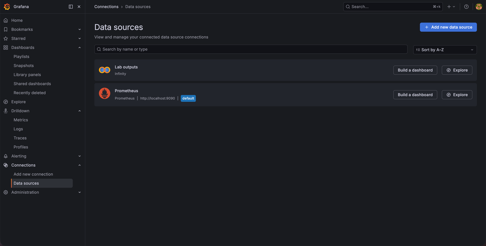

# 安裝 Grafana 並連接 Prometheus

官方文件：[安裝說明](https://grafana.com/docs/grafana/latest/setup-grafana/installation/)、[下載頁](https://grafana.com/grafana/download/)

**前置條件：** Prometheus 已安裝並正在運作（[02-install-prometheus.md](02-install-prometheus.md)）。

這一步要安裝 Grafana，並且接上 Prometheus。原始指標存在 Prometheus 裡，Python 算出來的分數與
告警狀態也一樣，所以 Grafana 這一端只需要這一個 datasource。

## 1. 安裝 Grafana

**macOS：**

```bash
brew install grafana
brew services start grafana
```

**Linux（Ubuntu / Debian）：**

```bash
sudo apt-get install -y apt-transport-https software-properties-common wget gpg
sudo mkdir -p /etc/apt/keyrings
wget -q -O - https://apt.grafana.com/gpg.key | gpg --dearmor | sudo tee /etc/apt/keyrings/grafana.gpg > /dev/null
echo "deb [signed-by=/etc/apt/keyrings/grafana.gpg] https://apt.grafana.com stable main" | sudo tee /etc/apt/sources.list.d/grafana.list
sudo apt-get update && sudo apt-get install -y grafana
sudo systemctl enable --now grafana-server
```

其他發行版見[官方安裝文件](https://grafana.com/docs/grafana/latest/setup-grafana/installation/)。

**Windows：** 從[下載頁](https://grafana.com/grafana/download/)選 Windows 下載 `.msi` 安裝。服務會自動啟動，沒有的話在系統管理員權限的 PowerShell 執行 `Start-Service Grafana`。

## 2. 啟動

在瀏覽器開啟 <http://localhost:3000>，帳號密碼都是 `admin`，系統會要求改密碼。


## 3. 建立資料來源

複製 provisioning 檔再重新啟動，datasource 就會出現。

**macOS：**

```bash
cp infra/grafana/provisioning/datasources.yaml \
   "$(brew --prefix)/share/grafana/conf/provisioning/datasources/aiops.yaml"
brew services restart grafana
```

**Linux：**

```bash
sudo cp infra/grafana/provisioning/datasources.yaml \
   /etc/grafana/provisioning/datasources/aiops.yaml
sudo systemctl restart grafana-server
```

**Windows：** 在 PowerShell 執行，`$repo` 換成自己 clone 的位置：

```powershell
$repo = "<你的路徑>\aiops-anomaly-zero-to-hero"
Copy-Item "$repo\infra\grafana\provisioning\datasources.yaml" `
  "C:\Program Files\GrafanaLabs\grafana\conf\provisioning\datasources\aiops.yaml"
Restart-Service Grafana
```

也可以手動新增，在 **Connections → Data sources → Add data source** 選 Prometheus，server URL 填 `http://localhost:9090`，按 **Save & test** 應出現 "Successfully queried the Prometheus API"。



## 4. 驗收

開 <http://localhost:3000/explore>，datasource 選 `Prometheus`，查詢 `up`，應該回 `job="prometheus"`
值是 `1`。

另外兩個 job 現在還不會有值，那是正常的。`job="node-exporter"` 要等你完成
[04-install-node-exporter.md](04-install-node-exporter.md)，`job="aiops-detector"` 要等
Lab 00 啟動那支偵測服務。

## 常見問題

**瀏覽器無法開啟 `localhost:3000`？**
確認服務已啟動。macOS 執行 `brew services list`，Linux 執行 `systemctl status grafana-server`，Windows 在 PowerShell 執行 `Get-Service Grafana`。

**Save & test 失敗？**
先確認 Prometheus 能在 <http://localhost:9090> 開啟。資料來源 URL 應填 `http://localhost:9090`，`3000` 是 Grafana 自己。

**`up` 這個 query 在 Explore 裡查不到 `node-exporter`？**
整筆 job 不存在就是 Prometheus 載錯設定檔，見 [02-install-prometheus.md](02-install-prometheus.md)〈用 service 啟動〉。Dashboard 的排查在 [`labs/workshop/dashboard.md`](../workshop/dashboard.md)，這裡還沒有 dashboard 可以排查。
