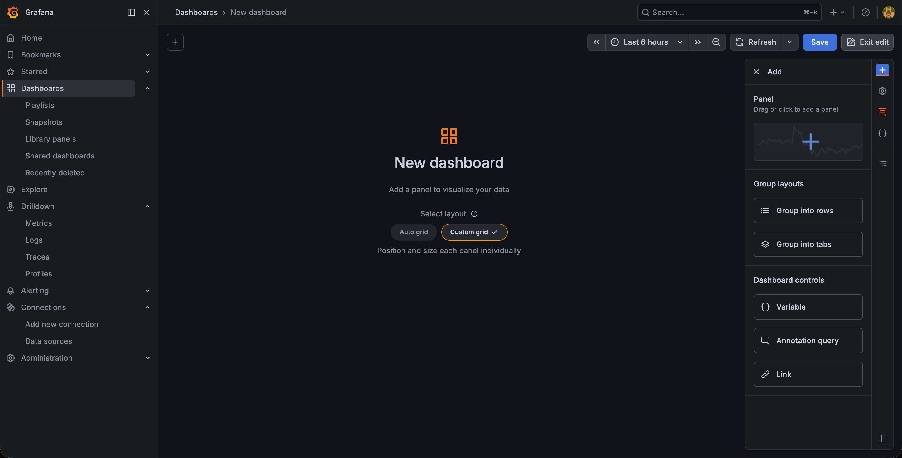
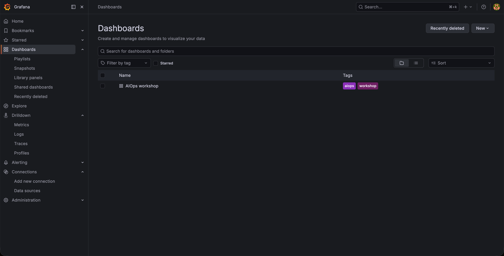
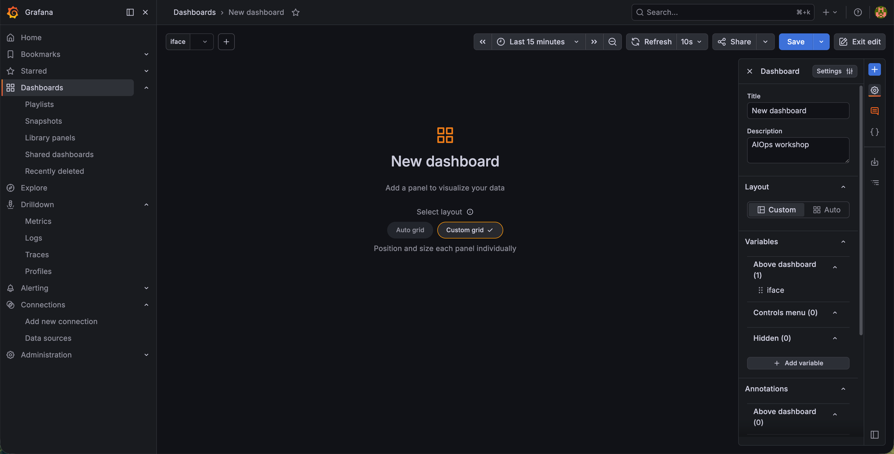
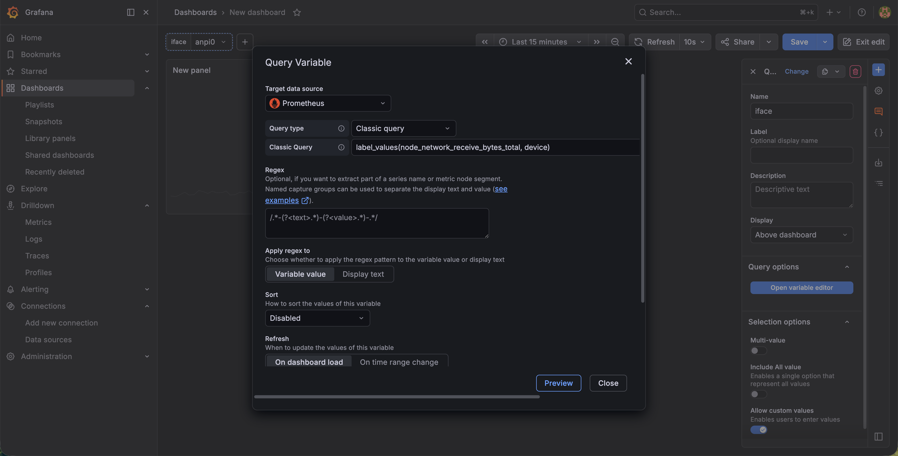
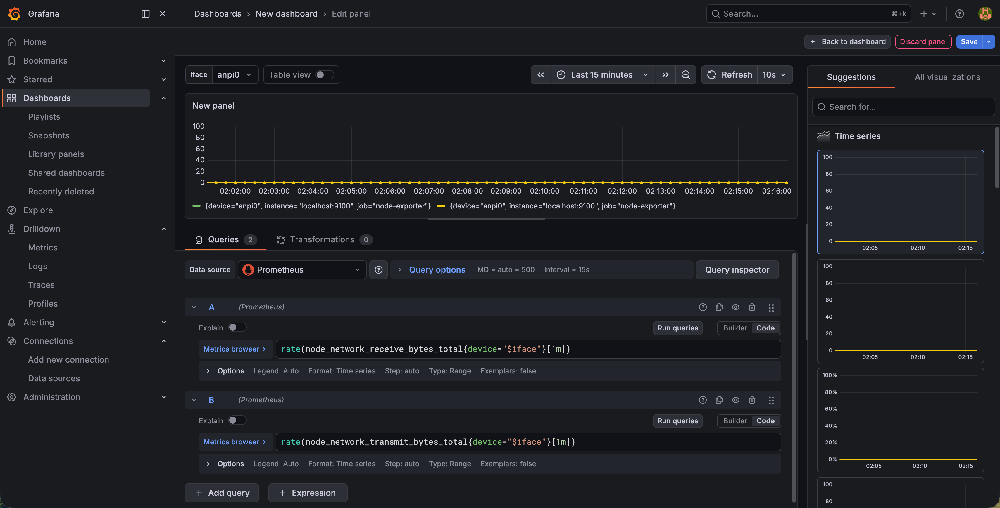
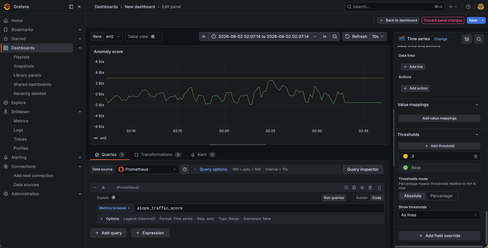
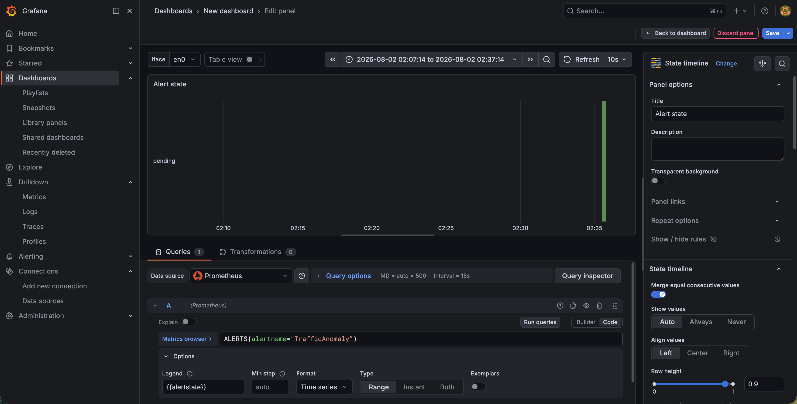

# 建立這門課的 dashboard

三張 panel 與一個變數，全部讀 Prometheus。原始速率存在那裡，`detector.py` 算出來的分數與告警狀態也存在那裡，所以三張 panel 用的是同一個 datasource。

**前提：** Prometheus 這個 datasource 在 setup 就設定完成，做法見
[`labs/getting-started/03-install-grafana-local.md`](../getting-started/03-install-grafana-local.md)。
`Connections > Data sources` 列得出 `Prometheus` 才往下做。第二張與第三張 panel 還需要
`detector.py` 正在執行，那是 Lab 00 第 5 節的事。

## 建立 dashboard 與變數

Dashboards > New > New dashboard > Add visualization，datasource 選 Prometheus。先存檔
（Ctrl/Cmd+S）取個名字，例如 `AIOps workshop`。



再開右上角齒輪 Settings > Variables > New variable：Name 填 `iface`，Type 選 `Query`，
datasource 選 Prometheus。Query type 選 `Classic query`，
下面那一格填 `label_values(node_network_receive_bytes_total, device)`。
Windows 的 exporter 換成 `label_values(windows_net_bytes_received_total, nic)`。




存檔。左上角會多一個 **iface** 下拉，選 notebook 第 2 節印出來的那一張網路卡。

## 第一張：Throughput, receive and transmit

原始訊號。回到 dashboard，Edit panel，貼兩條 query：

```promql
rate(node_network_receive_bytes_total{device="$iface"}[1m])
rate(node_network_transmit_bytes_total{device="$iface"}[1m])
```


兩條的 Legend 分別填 `receive`、`transmit`。Panel options 的 Title 填 `Throughput, receive and
transmit`，Standard options 的 Unit 選 `Bytes/sec (Bps)`。

這張應該立刻有線。沒有線就回 Explore 查詢 `up`，值是 0 表示 exporter 沒有啟動，或 Prometheus 沒有抓到它。

## 第二張：Anomaly score

`detector.py` 算出來的分數，這是第二張 panel。先按 `Back to dashboard` 退出第一張的編輯畫面，
再點右側編輯面板頂端那個 `+`，選 `Panel`。datasource 一樣是 Prometheus，PromQL query：

```promql
aiops_traffic_score
```

Legend 填 `{{device}}`，Title 填 `Anomaly score`。再到 Standard options 把 Min 填 `-6`、Max 填
`6`，然後在 Thresholds 新增一條 `3`，Show thresholds 選 `As lines`。門檻畫成線之後，這張 panel 與
`alerts.yml` 裡 `TrafficAnomaly` 的條件就是同一件事的兩種表示。


這條 query 不篩 `$iface`，因為 detector 只監看它自己挑中的那一張網路卡，寫死篩選條件反而容易得到空白。Legend 的 `{{device}}` 會告訴你它挑了哪一張，正常情況下就是上面那張 panel 選的那一張。

分數貼著 0 是對的，代表這段時間沒有事情發生。剛啟動 detector 的前 150 秒是暖機期，分數固定是 0。

## 第三張：Alert state

告警現在的狀態，第三張 panel。一樣退回 dashboard、`+` 選 `Panel`，
再到右側那一欄切到 `All visualizations`，選 `State timeline`，PromQL query：

```promql
ALERTS{alertname="TrafficAnomaly"}
```

Legend 填 `{{alertstate}}`，Title 填 `Alert state`。`ALERTS` 是 Prometheus 自己維護的指標，
每一則處於 Pending 或 Firing 的告警都會在這裡出現一筆，`alertstate` 這個 label 會區分兩者。
沒有告警的時候這張是空的。


## 排查

| 症狀 | 先查詢 |
| --- | --- |
| 第一張 panel 空白 | Explore 裡查詢 `up`。是 0 就是 exporter 沒有啟動，或 Prometheus 沒有抓到它 |
| 第一張有線但形狀是斜坡 | 查詢忘了包 `rate()`，畫到的是 counter 本身 |
| 第二張 panel 空白 | 查詢 `up{job="aiops-detector"}`。是 0 就是 `detector.py` 沒有在執行 |
| 第二張有線但一直是 0 | 還在暖機期，或者這段時間真的沒有異常。下載一個大檔案 |
| 第三張永遠空白 | 分數沒有越過 3，或者越過了但沒有撐滿 `for: 1m` |
| 三張都空白，時間軸卻有刻度 | 時間範圍。先改回 Last 1 hour |
| 重新整理後剛才建的 panel 不見了 | 沒有存 dashboard，Ctrl/Cmd+S 存一次 |
