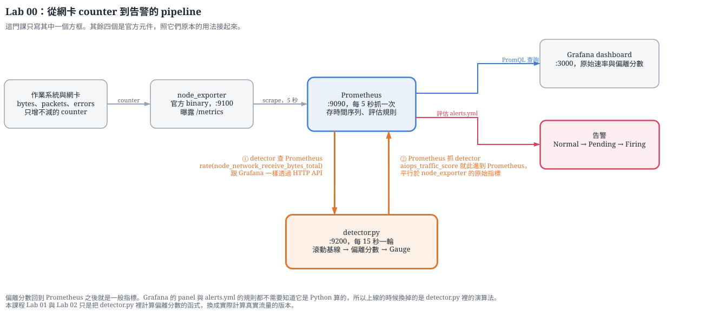
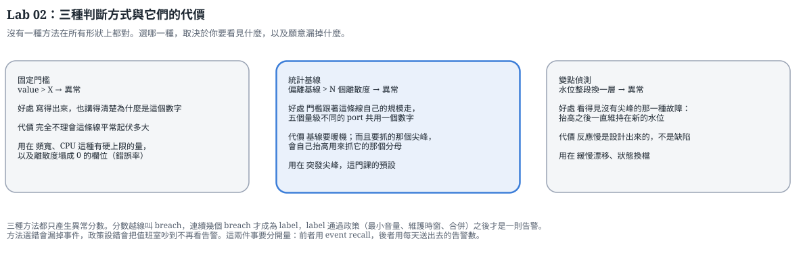

# 工作坊：從 telemetry 到 alert

講堂上把 anomaly 定義成在脈絡下相對於一條明確 baseline 的偏離。工作坊把這個定義變成可以執行的步驟：自行選定 baseline、計算偏離分數、以門檻把分數判定成 label、讓 label 通過 policy 篩選才成為
alert，最後用 event recall 與 alerts per day 評估這組設定是否值得交給值班人員。

## pipeline 的五個環節

Lab 00 建立這條 pipeline，之後不再改動它。



`node_exporter` 曝露這台機器的網路 counter，Prometheus 每 5 秒抓一次。
[`detector.py`](detector.py) 反過來向 Prometheus 查詢這段流量，算出偏離分數，再把分數曝露成
`/metrics`，於是 Prometheus 把它當成一般指標抓回去。Grafana 用 PromQL 查詢分數，
`infra/prometheus/alerts.yml` 的規則也直接打在分數上。

除了 `detector.py`，pipeline 上每一個元件都是官方軟體。分數送回 Prometheus 之後，下游沒有任何一格知道它是 Python 算的，這一點是刻意設計的，因為上線要換的只有演算法，pipeline 可以原封不動。

所以 Lab 00 之後的每一節都只做一件事，把 `detector.py` 裡 `rolling_zscore()` 那個函式換成撐得住真實流量的版本。Lab 01 決定該把哪個量餵進去，並且先確認那個量本身可信；Lab 02 決定 baseline 怎麼算、要不要換成多變量模型，以及偏離分數之外還要包什麼政策才配送出去。之後補進來的單元同樣落在這個函式上。

## 評估用的資料來源

Lab 00 之後的每一節讀的都是 `data/synthetic/synthetic_rrd_metrics.csv`，五個 port、一整個月、
十八個標好的事件。用歷史資料是因為演算法要拿有真值的資料去量，而 Lab 00 的 pipeline 上跑的是這台機器此刻的流量，沒有真值可比。

這些 notebook 全程用 matplotlib 畫圖，產出留在 notebook 裡。定住的圖適合逐條比較，Grafana
上那三張 panel 畫的是即時的線，適合換條件驗證。

三種偵測方法的取捨見下圖。



## 開課前要維持執行的四個服務

前三個安裝完成後就常駐執行，第四個在 Lab 00 第 5 節啟動，啟動之後整場工作坊都留著。

```bash
brew services start prometheus     # http://localhost:9090
brew services start grafana        # http://localhost:3000
brew services start node_exporter  # http://localhost:9100/metrics

# 在教材根目錄，這個視窗留著
python labs/workshop/detector.py   # http://localhost:9200/metrics
```

Prometheus 要讀教材裡的設定，才會有 `aiops-detector` 這個 job 與告警規則：

```bash
cp infra/prometheus/prometheus.macos.yml /opt/homebrew/etc/prometheus.yml
cp infra/prometheus/alerts.yml           /opt/homebrew/etc/alerts.yml
curl -X POST http://localhost:9090/-/reload
```

Linux 與 Windows 的對應做法見 [`labs/getting-started/02-install-prometheus.md`](../getting-started/02-install-prometheus.md)。
Windows 的 exporter 是 `windows_exporter`，聽在 9182，設定檔用 `prometheus.windows.yml`。

## Grafana 這一端

只有 Prometheus 一個 datasource，在 setup 那一步就設定完成。原始速率存在裡面，偏離分數與告警狀態也一樣，所以 Grafana 這一端一律用 PromQL 查詢。

三張 panel 在 Lab 00 逐格建立，做法寫在 [`00-dashboard.md`](00-dashboard.md)。
`infra/grafana/dashboards/aiops-workshop.json` 不是這三張，那是一份示範用的 dashboard，
讀的都是環境設定完成之後就有的資料，匯入就能確認 Prometheus 與 Grafana 之間接通了。

## 這一批的單元

`labs/workshop/` 底下實際有幾份 notebook，以你收到的教材為準。檔名前面的編號就是順序，不能跳，
後一節的偏離分數建立在前一節算出來的 baseline 欄位上。

Lab 00 把 node_exporter、Prometheus、`detector.py` 與 Grafana 串成一條可運作的 pipeline。內容包括
counter 與 rate 的換算、`up` 怎麼判讀、Python 服務怎麼註冊成 Prometheus 的 scrape target、`for:`
怎麼濾掉單一取樣的越線，最後刻意在四個位置製造故障，逐一定位是哪一段中斷，大約 45 到 60 分鐘。
之後每一節替換的都是計算偏離分數的那一段。

Lab 01 走課程投影片上第 4 到第 7 格。前五步先驗證資料本身：去重與排序、缺值與時間軸完整性、平滑要付的價錢、以及重採樣到多粗才會開始損失 event。後十一步從 raw counter 建立可比較的特徵，用相關矩陣、事件與特徵的熱圖、留一法消融量出每一欄真正的邊際貢獻與每日誤報代價，最後把決定寫成 `feature_spec.json` 交給下一節。

Lab 02 走第 8 格。先在同一段流量上比較四種 baseline，分別是 rolling mean、median 與 MAD、same
seasonal position 與 peer group，再看 CUSUM、EWMA 與變點偵測各自補上什麼。第 10 到 13 步換一類方法，
用 Isolation Forest、One-Class SVM 與 Local Outlier Factor 處理逐欄計分處理不了的欄位，並且把四種
偵測器放在同一張成績單上比較。最後把偏離量以門檻判定成 label，套上 duration、minimum volume 與
maintenance exclusion 三道政策才送出 alert，用 scorecard、二維參數掃描與時間保留集量這組設定的誤報代價與可信度。

Lab 01 約 75 到 90 分鐘，Lab 02 約 90 到 110 分鐘。

## notebook 裡的 toolkit

每一個函式定義在第一次用到它的那一格，載入、baseline、偵測器、alert policy、事件評估都是如此，可以直接閱讀與修改。這門課不把它們收進要另外理解的函式庫，資料科學的邏輯留在 notebook
裡，不藏在 `import` 後面。

每一份 notebook 各自帶自己需要的函式，所以有些函式會重複出現。重複是為了讓每一份都能單獨開啟、單獨讀完。唯一的例外是 Lab 00，它直接 `import` `detector.py` 裡的函式，因為那一節要說明的正是「notebook 裡試的那一段，跟服務跑的是同一段」。

Lab 01 內部是個小例外：`floor_of`、`rolling_mean`、`rolling_robust` 與 `z_of` 定義在最上面的設定格，
不在第一次用到的第 11 步，因為第 4 步與第 5 步就需要 scale 的估計。第 11 步負責解釋這兩種估計法的差別。
